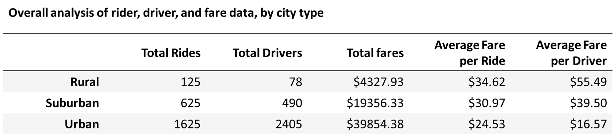

# PyBer_Analysis
## Project overview
Analyzing PyBer's rider, driver, and fare data is critical for understanding the business and planning for future growth. I completed a comprehensive analysis of the ride_data and fare_date using a variety of tools and techniques.  

To understand the data, I have provided the following charts.  
Fig_1: Py-Ber Ride Sharing Data (2019) is a bubble chart that shows the correlation between fares and number of rides, by type of city.   

Fig2,3,4: Box-Whisker charts that show the range, mean, median, and distribution of counts of rides, fares, and drivers for each city type.    
Fig5,6,7: Pie charts that show the percentage of rides, fares, and drivers for each city type.  

The data and charts I describe above present a granular look at every aspect of the company’s business. But we still need an overall picture and assessment, and also a detailed review of how fares have changed over time.  
## Challenge Part_1
To address management’s key questions about the overall summary of the business based on the data. I created a summary analysis that showcases the following for each city type: Total Rides, Total Drivers, Total Fares, Average Fare per Ride, and Average Fare per Driver. Please review the following for a summary of the analysis.  

    

As the table shows, the company’s business is fueled in large part in urban cities. Out of 2375 rides in the period considered, over 68 percent of rides cities are in urban and another 26 percent are in suburban cities. More than 80 percent of drivers are in urban cities, and 16 percent in suburban, leaving only 2 percent of drivers in rural areas. As a result, fares in rural areas are about 40% higher on a per ride basis. And the lower competition also results in greater income for rural drivers, where they make over $55 per ride on average compared with just over $16 per ride in urban cities.

## Challenge Part_2
The second part of management’s question relates to fare trends over time in each type of city. For this analysis, I created several cuts of the data that would enable us to generate a line chart that shows total fares in a week as a time series. Please review the following chart for a guide on fare trends.  
  

This is a summary table of the results: 

The data clearly show the following:
-	Rural fare totals are much smaller weekly, amounting to $230 on average. However, they are a lot more variable with a std deviation of almost $114 (or 50% of the mean). 
-	Urban weekly fare totals average about $2160 (almost 10x of rural areas) and are also much less variable with a std dev of just $222, or around 10%.
-	Suburban cities are also much smaller than urban cities in their profile, with average weekly fares of $1040 (around half of urban cities) but their variability is similar at $171 or about 15% of average fares.  

## Conclusions
We have quantified the differences in the level of activity between urban, suburban, and rural areas in rides, fares, and driver data. Clearly, there is an order of magnitude less volume in rural areas and a corresponding difference in fares collected. It is most likely that supply/demand factors drive these disparities more than any other factor but that's an area for further analysis. With what we have observed, the data also suggests that continuing aggressive driver recruitment in urban and suburban areas is the best strategy for growth. I’d also recommend that we expand our data analytics efforts by incorporating data on seasonality and other demand patterns. It would also be helpful to analyze if there is untapped market demand in suburban areas in particular, and in rural areas to a lesser extent.
